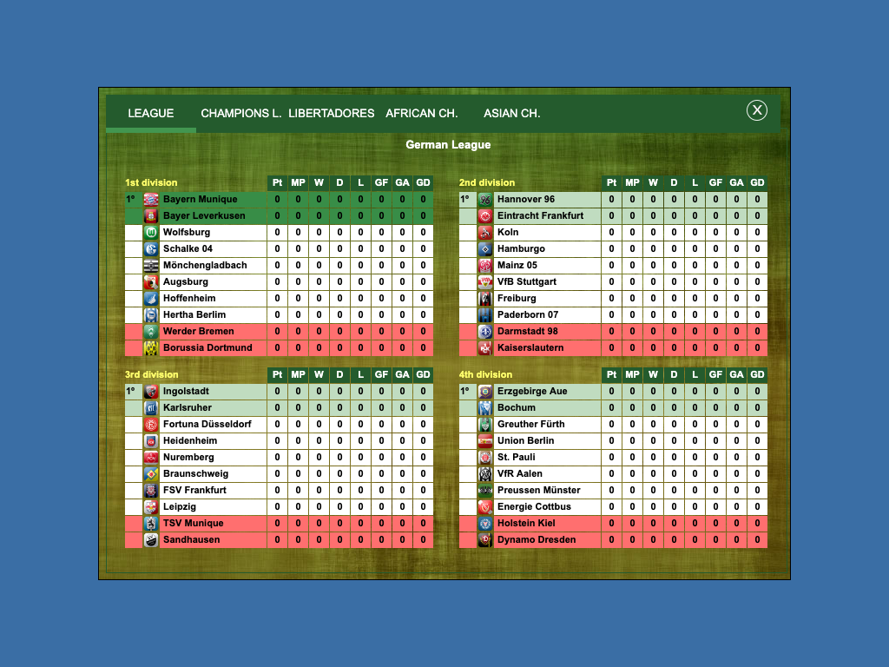

# Cyberfoot 2015 — completed-work report

**10 September 2026.** This report describes the work preserved in this repository. It supersedes the older cumulative counts and limitations in incremental READMEs; the detailed progress ledger remains available.

## Current outcome

Two distinct implementations exist. The **emulator edition was published** and runs the unchanged Windows executable through Boxedwine/Wine. The user then rejected emulation and requested a native web reconstruction. That **native reconstruction is substantial but unfinished and unpublished**.

The requested full original gameplay, UI, design and all-functionality availability have not been delivered. No registration bypass or complete feature unlock has been implemented. Passing tests below establish specific behaviors, not completion of the game. There is no defensible overall completion percentage.

## Malware assessment

The original RAR, extracted installer and payload were scanned with ClamAV 1.5.4 using signatures dated 9 September 2026. The recorded scan reports **1,704 files scanned and zero infected files**. This is a single-engine result, not a safety certification.

The installer was extracted without running it. The distributor shortcut was read as text. Archive content was treated as evidence rather than instructions. Later, the unchanged game was run inside browser emulation to validate that edition; the installer and shortcut remained unexecuted. Samples were not submitted to external scanning services.

Static inspection covered executable structure, imports, resources, strings and extracted-file inventories. No embedded Authenticode signature was present. No WinInet, WinHTTP or Winsock imports were found, but dynamic loading means that does not prove an absence of networking. Exhaustive behavioral malware analysis was not performed.

| Sample | SHA-256 |
|---|---|
| Original RAR | `f9ecc2165c1c767cd130cdc2f58c487dc3c293b3686528c848c4d82dbbc100e7` |
| Extracted game | `bb5132cfcf9c7f17733c6d8c73ff0cebb5b4b19e34dff34c614919beedc308d0` |

Evidence: [assessment](../cyberfoot-analysis/reports/MALWARE-ASSESSMENT.md), [scan log](../cyberfoot-analysis/reports/clamav-scan.log), [file manifest](../cyberfoot-analysis/reports/manifest.json).

## Reverse engineering

Recovered material includes approximately **8,050 function listings and 91 form definitions**, Delphi metadata and named methods, PE resources, decoded club/name/language data, function inventories, call graphs, assembly excerpts and a reusable Ghidra project.

The listings are machine-generated pseudocode, not original source or directly compilable recovered code. Assembly inspection exposed incorrect register arguments, loop variables and missing floating-point behavior in decompiler output. Where practical, the native implementation was checked by executing isolated original routines and comparing results.

Python scripts preserve analysis and comparison workflows. The original executable is used by development comparison tools; the native JavaScript game modules do not execute it.

Evidence: [reports](../cyberfoot-analysis/reports/), [decompiled listings](../cyberfoot-analysis/decompiled/), [scripts](../cyberfoot-analysis/scripts/), [resources](../cyberfoot-analysis/resources/), [decoded data](../cyberfoot-analysis/decoded-data/).

## Published emulator edition

The earlier deployment is [Cyberfoot 2015 original](https://cyberfoot-2015-original.otaliptus.chatgpt.site/). Its source uses Boxedwine 26R1 JavaScript/WebAssembly, Wine 11 minimal filesystem, supplementary graphics/font libraries and the unchanged game. Runtime archives were split to meet hosting asset limits.

Browser filesystem persistence and backup/restore controls were implemented. Startup remains slow and downloads substantial; audio was disabled for compatibility. Original registration restrictions remain intact. This is an earlier deliverable, not the native replacement. This repository snapshot does not deploy or alter that site.

Source: [web application](../cyberfoot-web/app/), [runtime assets and notices](../cyberfoot-web/public/emulator/), [wrapper README](../cyberfoot-web/README.md).

## Native implementation

The native work is in [native-port](../cyberfoot-web/native-port/).

### Match engine

Implemented components include the original random generator and clock reseeding behavior; explicit x87-style precision and rounding; possession and pitch-zone transitions; passes, shots and set pieces; formation strength; player/scorer selection; cards, injuries, substitutions and fatigue; regulation timing and extra-time/penalty components; event dispatch and statistics.

Human decision dialogs and tactical changes are connected in development match flows. A lineup-to-match integration uses saved players, manual changes and original kits, reaches full time and shows archived results. This does not establish full equivalence across all competitions and starting states.

### Save format, calendars and records

The reader/writer handles **all 39 original save sections**, preserving unknown bytes. The **2,658,632-byte reference save** round-trips unchanged. Tests verify that player, club, finance, manager and match-result changes survive save/reload.

Calendar construction and advancement, participation checks, fixture scheduling helpers, competition history, match archives and player resets are implemented. The completed match date is retained separately from the advancing calendar date, matching the original post-round behavior.

### Players, finance and transfers

Implemented routines cover wages, contract decisions and renewals, payroll, match finance, player value, senior/youth development and age effects, loans, scheduled returns, immediate recalls, roster updates, paid transfers and AI transfer selection.

These preserve relevant integer behavior, random-draw order, accounting, history and notifications. Original-save integration tests cover full squads delaying player returns, retries after vacancies and completed transfer transactions.

### Manager careers

Implemented work includes participation checks, appointment and departure, replacement selection, AI changes, dismissal effects, replacement-manager generation, employed/unemployed offer selection and timing, acceptance/rejection, contract effects and welcome news.

Original-style dismissal, recap and offer dialogs are connected in development flows. Tests verify waiting for modal decisions, persisting accepted moves and opening nested standings without save mutations.

### Competitions

Implemented components include league standings and qualification highlights; seven regional formats; regional tables, knockout captions and geometry; continental group tables; knockout progression helpers; champion/history routines; and result-performance adjustments.

Continental post-round processing ranks groups, eliminates clubs, records finishes and seeds two-legged fixtures. Its result-performance children have original-execution comparisons, and the complete controller now passes **200 whole-routine original-execution comparisons** with the performance application included.

International post-round qualification is connected. Competition 8 advances the top two in three groups plus the two best third-place teams. Competition 9 advances the top two in four groups. Original quarter-final pairings and participation flags are preserved. The complete routine passes **800 original-execution comparisons**.

National squad setup is implemented for competitions 7, 8 and 9 (8, 3 and 4 four-club groups). Eligibility uses the original 18 outfield players plus 2 goalkeepers rule with club range and injury date checks, selection applies the extracted `[3,4,4,8,6]` role quotas through the original sort, and previous and new assignments are recorded for restoration. The whole routine passes **600 original-execution comparisons** plus an original-career fixture integration test.

The competition 5 club-world field is implemented. The 18 original countries seed six slots from league ranking records or ranked country candidates, four continental champions are resolved, the original weighted fallback tables fill the remaining slots, and the six clubs are written into the pairing records and flagged. It passes **400 original-execution comparisons** plus an original-career fixture test covering the success path, the original reinstall-error branch and deterministic replay.

## UI reconstruction

Recovered definitions and assets drive lineup, match, tactics, results, dismissal, manager recap, offer and standings screens. Original crests, kit images, captions, colors and geometry are used where recovered and connected.

Browser checks exercise desktop/narrower layouts, modals, selection, acceptance/rejection, supported keyboard dismissal, scrolling and save immutability. Screenshots were visually inspected during development.

This is not pixel-perfect certification. Font rasterization, some control skins, tooltips, dynamic presentation and numerous original forms remain provisional or incomplete. Recovered form data does not mean every form is implemented.

## Verification and repairs

The cumulative development ledger records **256,477 original-comparison cases** through the latest full-parity round. This is a historical coverage count, not unique features or a formal equivalence guarantee. Older READMEs contain earlier totals.

Verification combines isolated original-instruction comparisons, whole-routine comparisons, original-save integration, browser interaction tests and screenshot inspection. Depending on the test, adapters substitute Delphi storage/string operations, UI boundaries or unported children. Those distinctions limit the claims each test supports.

A significant regression was found and fixed: a new result-performance dispatcher collided with the existing competition-result filename. The original fixture-statistics implementation and tests were restored; the new dispatcher was renamed `match-performance-result.mjs`. Both now have distinct tests. The progress ledger preserves the incident and validation history.

The [latest development regression log](evidence/cyberfoot-national-postround-regression.log) and [fresh repository regression log](evidence/repository-regression.log) are included. The latter was generated from this independent snapshot. Broad green tests do not prove uninterrupted full-career play.

## Remaining work

- Remaining competition scheduling dependencies.
- Season-end processing and remaining career routing controllers.
- Career entry/new-game initialization. A development continuous loop now chains the native lineup, watched match, archived results and the full results continuation back into the next fixture; the original next-screen forms remain to be populated.
- Remaining management functions and screens, including incomplete training/stadium flows.
- Full UI fidelity, sound and platform-clock decisions.
- Broader full-career and season validation, plus missing whole-controller comparisons.
- Native deployment and verification of the published replacement.
- Requested all-functionality availability, which has not been delivered.

Incomplete continuation paths reject missing effects rather than silently pretending that career advancement succeeded.

## Repository scope and handoff

This is a new independent snapshot with fresh Git history. It preserves emulator and native source, test fixtures/vectors, analysis scripts/reports, recovered resources/data, extracted original game payload and the Ghidra project. The previous hosting remote is unchanged. After the initial snapshot, the user requested removal of duplicate folders: the new repository was moved directly into `misc`, retaining the original source directories. The older hosting Git metadata is archived locally under `.local-history/cyberfoot-web-hosting.git`. All 11,991 copied files were checked against the originals before the duplicate directories were removed.

Excluded: installed dependencies, Python/tool environments, antivirus databases, build caches, prior Git history, hosting account configuration, duplicate emulator download staging, distributor installer/shortcut staging and bulk transient browser output. The emulator wrapper's runtime assets remain included. Selected screenshots and test logs are retained.

The source RAR stays in Downloads and is not copied here. Original game and third-party components retain their rights; this snapshot establishes no new redistribution permission and asserts no blanket open-source license. The repository is private.

Use the root README for tests/previews and [progress.md](../cyberfoot-web/progress.md) for detailed implementation history. Older prose contains superseded limitations; current modules and tests remain the source of truth.
